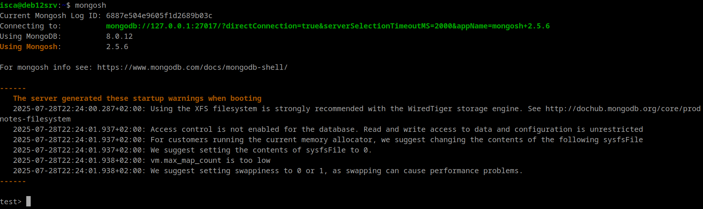
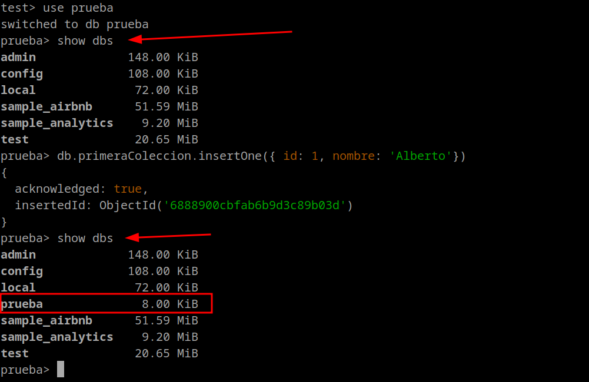
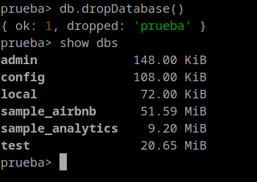

# Primeros pasos
Una vez instalada la base de datos, vamos a interactuar desde su propia consola.


## Trabajando con MongoDB desde la consola
En la máquina donde tenemos instalada la base de datos, podemos acceder a la consola de MongoDB escribimos:

```bash
mongosh
```

<figure markdown="span">
    {width="100%" }
    <figcaption>Acceso a través de la consola</figcaption>
</figure>

Vemos que cuando accedemos a través de la consola, nos aparece una serie de recomendaciones que debemos realizar antes de comenzar a trabajar con MongoDB:

- Sistema de archivos XFS recomendado
- No hay control de acceso habilitado
- Aumentar la cantidad de mapeos de memoria virtual
- Swappiness

### Activar autenticación para MongoDB

1. Creamos el usuario a través de la consola de MongoDB:
```python
use admin
db.createUser({
  user: "admin",
  pwd: "password_fuerte",
  roles: [ { role: "root", db: "admin" } ]
})
```
2. Editamos el archivo de configuración `/etc/mongod.conf` y agregamos:
```yaml
security:
  authorization: enabled
```
3. Reiniciamos el servicio
```bash
sudo systemctl restart mongod
```
### Aumentar los mapeos

1. Consultamos los mapeos que tenemos actualmente:
```bash
cat /proc/sys/vm/max_map_count
```
2. Cambiamos el valor temporalmente
```bash
sudo sysctl -w vm.max_map_count=1048575
```
3. Para hacerlo permanentemente:
```bash
echo "vm.max_map_count=1048575" | sudo tee -a /etc/sysctl.conf
sudo sysctl -p
```

### Swappiness
1. Consultamos el valor actual:
```bash
cat /proc/sys/vm/swappiness
```
2. Cambiamos el valor temporalmente:
```bash
sudo sysctl -w vm.swappiness=1
```
3. Para hacerlo temporalmente:
```bash
echo "vm.swappiness=1" | sudo tee -a /etc/sysctl.conf
sudo sysctl -p
```
### Operaciones básicas
Conectamos desde la consola con un usuario:
```bash
mongosh -u admin -p 'PasswordSegura' --authenticationDatabase admin
```

Algunas de las operaciones básicas que podemos realizar son :

- Salir de la consola (`quit()` o pulsando `Ctrl+C`)
- Limpiar la consola (`Ctrl+L`)
- Listar las bases de datos (`show dbs`)
- Cambiarse de base de datos (`use <dbname>`)
- Listar las colecciones de una base de datos (`show collections` / `show tables`)
- Mostrar el nombre de la base de datos (`db.getName()` o `db`)
- Listar metadata sobre una base de datos (`db.stats()`)
- Solicitar ayuda sobre comandos (`db.help()`)
- Mostrar fecha y hora del sistema (`Date()`)
- Dar formato JSON (`db.<collectionName>.find().pretty()`)
- Mostrar información sobre el servidor (`db.hostInfo()`)

!!! info

    **db.hostInfo**: Este es un *atributo* que hace referencia a la información del sistema, pero no ejecuta la función. Al usarlo de esta manera, no se obtienen datos directamente; simplemente se esta accediendo a una propiedad.

    **db.hostInfo()**: Este es un *método* que, al ser llamado con paréntesis, ejecuta la función y devuelve un documento con información detallada sobre el sistema subyacente en el que se está ejecutando el servidor MongoDB. En este caso se incluyen datos como el nombre del host, la arquitectura de la CPU, la memoria disponible, entre [otros](https://www.mongodb.com/docs/manual/reference/method/db.hostInfo/)

## Creación y gestión de Bases de Datos

### Creación: `use`

El comando para crear una base de datos es el mismo que visto anteriormente para cambiar de base de datos: `use`

Así pues si intentamos entrar/acceder en una base de datos que no existe, hasta que no se inserte al menos un documento en una de sus colecciones, no estará disponible. Esto lo podemos hacer en el siguiente ejemplo:

```python
use prueba
show dbs
db.primeraColeccion.insertOne({ id: 1, nombre: 'Alberto'})
```

<figure markdown="span">
    {width="80%" }
</figure>

Todo esto es debido a que *MongoDB* planifica la existencia de una base de datos, pero hasta que no tenga su primer dato, no va a designar ningún tipo de recursos a la misma. En la captura anterior, se ve que ya le ha asignado 8 KiB a nuestra primera base de datos porque ya tiene algún dato.

Por otra parte, para la creación de una colección e inclusión de un documento en concreto, observar que simplemente al insertar el documento, si la colección no existe, la crea directamente, de la misma forma que ha hecho con la base de datos.

Más adelante ya veremos con más detenimiento las diferentes forma de insertar registro en un tabla (colección), de momento hemos usando el comando:
```python
db.primeraColeccion.insertOne({ id: 1, nombre: 'Alberto'})
```
### Eliminación: `db.dropDatabase()`

Para eliminar una base de datos, en primer lugar debemos estar ubicados dentro de la propia base de datos a eliminar y ahí ejecutamos el comando:

```python
db.dropDatabase()
```

Podemos hacer uso de los comandos use y db para pasar ubicarnos en una base de datos y comprobar que efectivamente lo estamos, aunque en el prompt de la propia shell de MongoDB directamente ya nos dice que estamos ahí:

<figure markdown="span">
    {width="70%" }
</figure>

### MongoDB Database Tools

Además del propio servidor de MongoDB y el cliente para conectarse a él, MongoDB ofrece un conjunto de herramientas para interactuar con las bases de datos, permitiendo crear y restaurar copias de seguridad.

Si estamos interesados en introducir o exportar una colección de datos mediante JSON, podemos emplear los comandos `mongoimport` y `mongoexport`:

```bash
mongoimport -d nombreBaseDatos -c coleccion –-file nombreFichero.json
mongoexport -d nombreBaseDatos -c coleccion nombreFichero.json
```

Estas herramientas interactúan con datos JSON y no sobre toda la base de datos.

!!! note
    Estos comandos se ejecutan desde la shell donde tenemos instalados MongoDB, no desde la propia shell de MongoDB

Un caso particular y muy común es importar datos que se encuentran en formato CSV/TSV. Para ello, emplearemos el parámetro `--type csv`. Por ejemplo, podemos descargar el fichero [personas.csv](files/personas.csv) e importarlo en la bd test:


```bash
mongoimport --username admin --password "simarro2025." --authenticationDatabase admin --type csv --db test --collection personas --headerline --file personas.csv
```

Donde
- `--type` : indica el tipo de fichero; csv o tsv
- `-d` o `--db`: indica la base de datos
- `-c` o `--collection` : indica la colección
- `--headerline`: en un csv o tsv indica que la primera línea contiene los nombres de los campos

Mas información en el [Manual de MongoDB: mongoimport](https://www.mongodb.com/docs/database-tools/mongoimport/)

En lugar de realizar un *export*, es más conveniente realizar un backup en binario mediante `mongodump`, el cual genera ficheros *BSON*. Estos archivos posteriormente se restauran mediante `mongorestore`:

```bash
mongodump -d nombreBaseDatos nombreFichero.bson
mongorestore -d nombreBaseDatos nombreFichero.bson
```

Si necesitamos transformar un fichero *BSON* a *JSON* (de binario a texto), tenemos el comando `bsondump`:

```bash
bsondump file.bson > file.json
```
Más información sobre copias de seguridad en la documentación oficial de [MongoDB: MongoDB Backup Methods](https://www.mongodb.com/docs/manual/core/backups/).

Para poder trabajar con MongoDB desde cualquier aplicación necesitamos un driver. MongoDB ofrece drivers oficiales para casi todos los lenguajes de programación actuales. En una sesión posterior trabajaremos con `pyMongo`.

En cuanto a la **monitorización**, tanto `mongostat` como `mongotop` permiten visualizar el estado del servidor *MongoDB*, así como algunas estadísticas sobre su rendimiento. Si trabajamos con MongoAtlas estas herramientas están integradas en las diferentes herramientas de monitorización de la plataforma.

## Tipos de datos
Aquí tienes una lista de algunos tipos de datos comunes en MongoDB, junto con ejemplos de cómo se representan en formato de tabla:

| Tipo de Datos        | Descripción                        | Ejemplo                                      |
|----------------------|------------------------------------|----------------------------------------------|
| String               | Cadena de texto                    | "Hello World"                                |
| Number               | Número                             | 42                                           |
| Boolean              | Valor booleano (true/false)        | true                                         |
| Date                 | Fecha y hora                       | ISODate("2024-03-01T12:00:00.000Z")          |
| Array                | Array de valores                   | [1, 2, 3]                                    |
| Object               | Objeto o documento anidado         | {"nombre": "Juan", "edad": 30}               |
| ObjectId             | Identificador único de documento   | ObjectId("61e4c3055b17967d02a9c3d7")          |
| Null                 | Valor nulo                         | null                                         |
| BinData              | Datos binarios                     | BinData(0, "ABC123==")                       |
| Regular Expressions  | Expresiones regulares              | /pattern/g                                   |

Recuerda que *MongoDB* es una base de datos NoSQL orientada a documentos, por lo que no tiene una estructura de tabla como las bases de datos relacionales. En MongoDB, los datos se almacenan en documentos *BSON* (Binary *JSON*), que pueden contener campos con diferentes tipos de datos, incluidos los mencionados anteriormente.

Es importante destacar que en *MongoDB*, los datos binarios y las expresiones regulares se representan de manera especial. Los datos binarios se representan mediante el tipo `BinData`, que incluye un tipo y una cadena de datos codificados en `base64`.

Las expresiones regulares se representan utilizando el formato `/pattern/flags`, donde `pattern` es el patrón de la expresión regular y `flags` son los modificadores de la expresión regular, como `i` para ignorar mayúsculas y minúsculas o `g` para realizar una búsqueda global.

!!! tip "El formato `/pattern/flags`"
    se utiliza comúnmente en expresiones regulares (regex) en varios lenguajes de programación, incluyendo JavaScript y MongoDB. Aquí te explico cada parte:

    `/pattern/`: Esta parte define el patrón que deseas buscar. El patrón puede incluir caracteres literales, metacaracteres y secuencias de escape. Por ejemplo, /abc/ buscaría la secuencia “abc”.

    `flags`: Los flags son modificadores que alteran el comportamiento de la búsqueda. Algunos de los flags más comunes son:
    
    - `i`: Ignora mayúsculas y minúsculas (case insensitive).        
    - `g`: Realiza una búsqueda global, es decir, encuentra todas las coincidencias en lugar de detenerse en la primera.
    - `m`: Permite que el carácter ^ y $ coincidan con el inicio y el final de cada línea, no solo del texto completo.
  

    Ejemplo:
    
    - Si quisieras buscar la palabra `“hola”` sin importar si está en mayúsculas o minúsculas en un texto, usarías `/hola/i`.

    Mas info en [MongoDb docs $regex](https://www.mongodb.com/docs/manual/reference/operator/query/regex/)


Aquí tienes un ejemplo de cómo se podría representar un documento en *MongoDB* utilizando algunos de estos tipos de datos:

```python
{
  "_id": ObjectId("61e4c3055b17967d02a9c3d7"),
  "nombre": "Juan",
  "edad": 30,
  "activo": true,
  "intereses": ["programación", "música", "viajes"],
  "ubicacion": {
    "ciudad": "Barcelona",
    "pais": "España"
  },
  "fechaRegistro": ISODate("2025-03-01T12:00:00.000Z"),
  "comentarios": [
    {
      "usuario": "Ana",
      "texto": "¡Hola Juan!"
    },
    {
      "usuario": "Carlos",
      "texto": "Saludos desde Xàtiva."
    }
  ]
}
```
<figure markdown="span">
    {width="100%" }
    <figcaption>Tipos de datos en MongoDB</figcaption>
</figure>

En este ejemplo, que ya hemos visto previamente para ilustrar qué es un *BSON*, el documento representa un usuario con campos como nombre, edad, activo, intereses, ubicación, fecha de registro y comentarios. Cada campo tiene un tipo de datos diferente, como string, number, boolean, array, object, date, etc.

Más información sobre tipos de datos en [MongoDB - Datatypes](https://www.tutorialspoint.com/mongodb/mongodb_datatype.htm)

